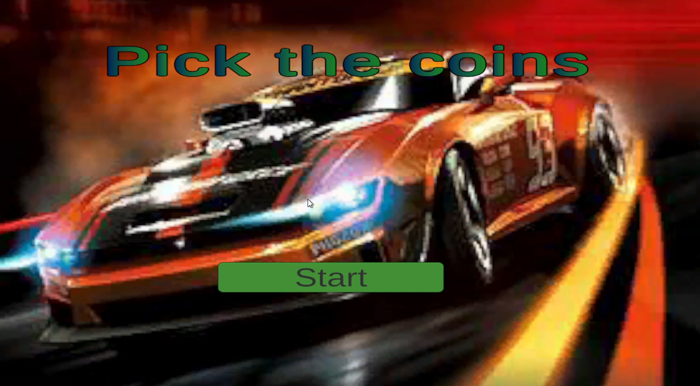
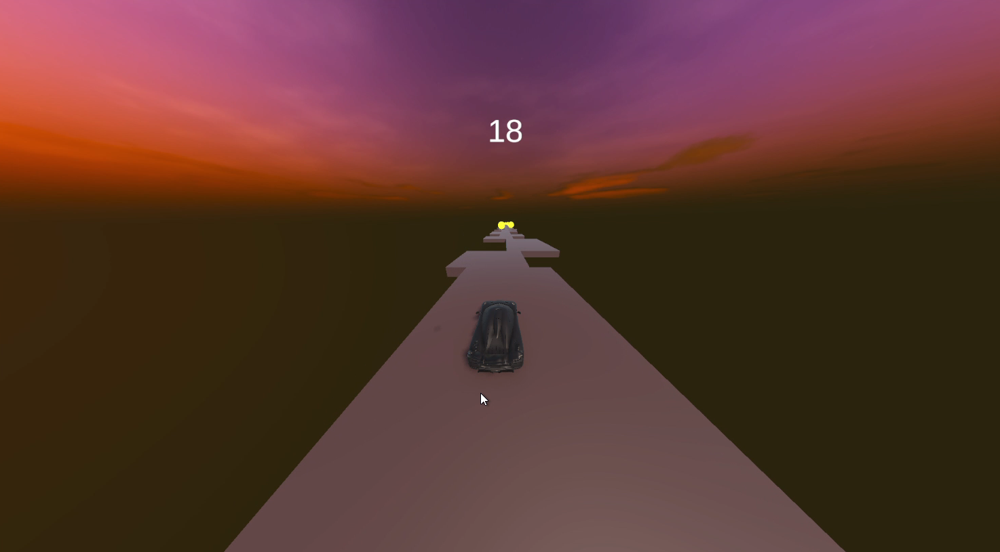
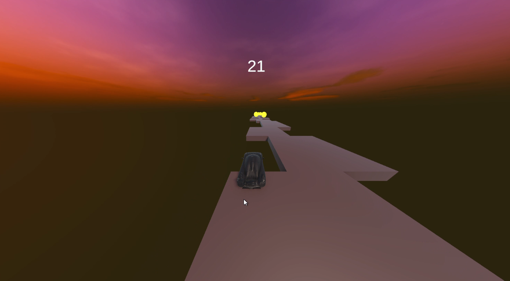
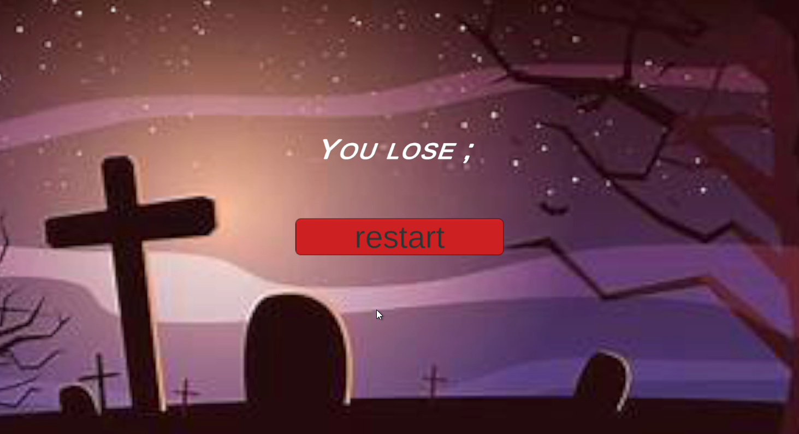

# 🚗 CAR PICK COIN

A simple 3D endless-style Unity game where the player controls a car moving forward on a dynamically generated platform while collecting coins.

This project focuses on core gameplay programming, procedural generation, and UI score handling.

---

## 🎮 Gameplay Description

- The car moves forward continuously on a plane
- The platform is generated dynamically as the car moves forward
- Random coins spawn on the platform
- When the car touches a coin, the score updates in the UI
- Player controls:
  - **A** → Move Left
  - **D** → Move Right
- If the car falls off the platform, the game restarts automatically

---

## 📸 Screenshots

### 🟢 Game Start

### 🟡 Platform Generation & Coin Collection

### 🔴 Falling Off the Platform

### ❌ Game Over Screen

---

## 🧠 Core Scripts Overview

- **Player.cs**  
  Handles car movement and player input (A/D keys)

- **LevelGeneration.cs**  
  Dynamic platform generation as the car moves forward

- **Coin.cs**  
  Coin collection logic and interaction with the player

- **UIManager.cs**  
  Updates score UI when coins are collected

- **GameManager.cs**  
  Manages game state and restart logic

- **SceneSwitcher.cs**  
  Reloads the scene when the player falls off

- **AudioManager.cs**  
  Handles sound effects

---

## 🛠 Tech Stack

- Unity (3D)
- C#
- Unity UI System

---

## 🎯 Purpose of This Project

This project showcases:
- Core gameplay programming
- Procedural level generation
- Collision detection
- UI score management
- Clean and modular game logic structure

---

## 📌 Future Improvements (Optional)

- Add obstacles
- Increase difficulty over time
- Add sound effects and background music
- Add main menu and pause system
- Mobile touch controls

---

⭐ If you like this project, feel free to star the repository!
